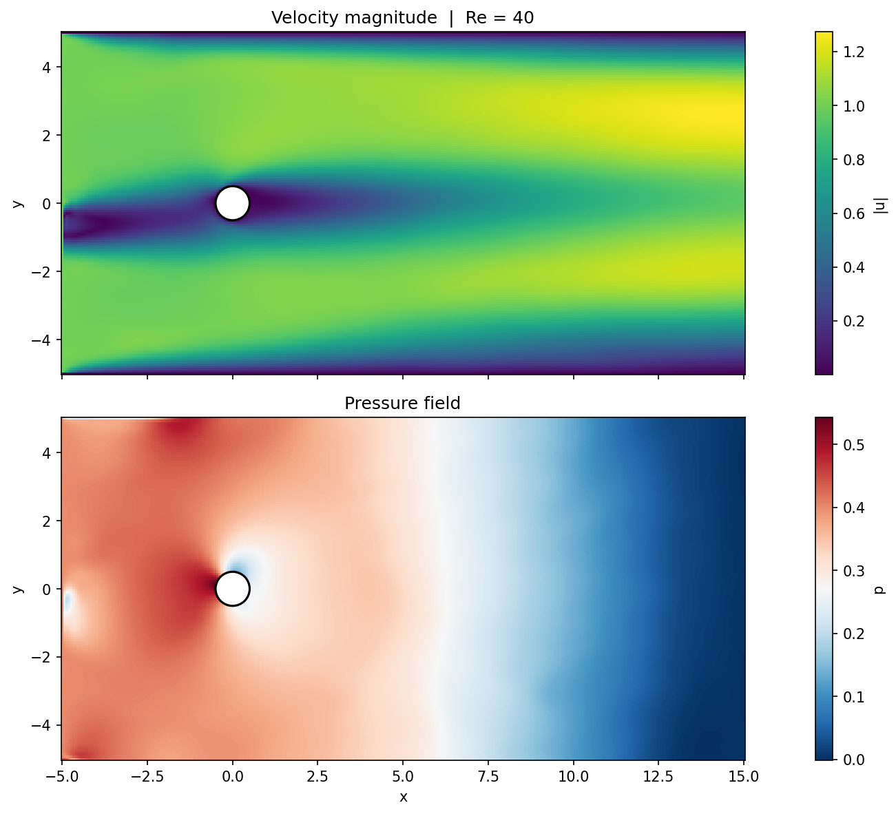

# Physics-Informed Neural Networks (PINNs) — Tutorial Series

A hands-on introduction to PINNs, progressing from the 1D heat equation to 2D Navier-Stokes flow.

---

## What is a PINN?

A **Physics-Informed Neural Network** is a neural network trained to satisfy both:

1. **Data constraints** — initial/boundary conditions (IC/BC)
2. **Physics constraints** — a governing PDE, enforced via automatic differentiation

Instead of learning from a dataset of observations, the network learns a solution function by minimizing a loss that penalizes PDE violations at randomly sampled collocation points. No simulation data is needed.

---

## Tutorial 1: 1D Heat Equation

**File:** `01_heat_equation_pinn.py`

We solve:

```
∂u/∂t = ν ∂²u/∂x²,   x ∈ [0,1],  t ∈ [0,1]
```

with initial condition `u(x,0) = sin(πx)` and zero Dirichlet BCs. The analytical solution is known, so we can measure accuracy directly.

### Network & Loss

A 3-hidden-layer MLP with `tanh` activations. Loss:

```
L = L_physics + 10·L_ic + 10·L_bc
```

### Results

After 5000 Adam epochs:

| Metric | Value |
|---|---|
| Max error | 2.58e-03 |
| Mean error | 7.36e-04 |
| L2 relative error | 1.41e-03 |


---

## Tutorial 2: 2D Navier-Stokes — Flow Past a Cylinder

**File:** `02_navier_stokes_pinn.py`

We solve the steady incompressible Navier-Stokes equations at Re=40:

```
u·∂u/∂x + v·∂u/∂y = −(1/ρ)∂p/∂x + ν(∂²u/∂x² + ∂²u/∂y²)
u·∂v/∂x + v·∂v/∂y = −(1/ρ)∂p/∂y + ν(∂²v/∂x² + ∂²v/∂y²)
∂u/∂x + ∂v/∂y = 0
```

Domain: rectangle `[-5, 15] × [-5, 5]` with a circular cylinder (D=1) at the origin.

### Boundary Conditions

| Boundary | Condition |
|---|---|
| Inlet (left) | `u = 1, v = 0`, soft pressure pin `p ≈ 0.4` |
| Outlet (right) | `p = 0`, Neumann `∂u/∂x = ∂v/∂x = 0` |
| Top/bottom walls | No-slip `u = v = 0` |
| Cylinder surface | No-slip `u = v = 0` |

### Architecture & Training

- **Network:** Random Fourier Feature embedding (σ=1, 32 frequencies) → 3×128 MLP with SiLU
- **Sampling:** Uniform collocation + near-cylinder dense annulus (R→4R) + outlet strip + residual-based adaptive sampling (50%)
- **Training:** Curriculum warmup (BC-only for 500 epochs) → Adam 3000 epochs → L-BFGS 750 steps
- **Device:** MPS (Apple Silicon GPU) / CUDA / CPU

### Results

| Metric | Value |
|---|---|
| Final physics loss | ~8.8e-04 |
| Cylinder no-slip | ~0 |
| Inlet velocity | ~0 |



---

## Project Structure

```
.
├── 01_heat_equation_pinn.py       # Tutorial 1: 1D heat equation
├── 02_navier_stokes_pinn.py       # Tutorial 2: 2D Navier-Stokes, cylinder flow
├── heat_pinn_result.png           # Output: heat PINN vs exact solution
├── heat_time_slices.png           # Output: heat equation time slices
└── ns_pinn_cylinder_re40.png      # Output: velocity & pressure fields at Re=40
```

---

## Requirements

```
torch>=2.4
numpy
matplotlib
```

Install with:

```bash
pip install "torch>=2.4" numpy matplotlib
```

---

## Run

```bash
# Tutorial 1
python 01_heat_equation_pinn.py

# Tutorial 2
python 02_navier_stokes_pinn.py
```
