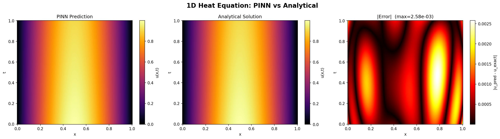
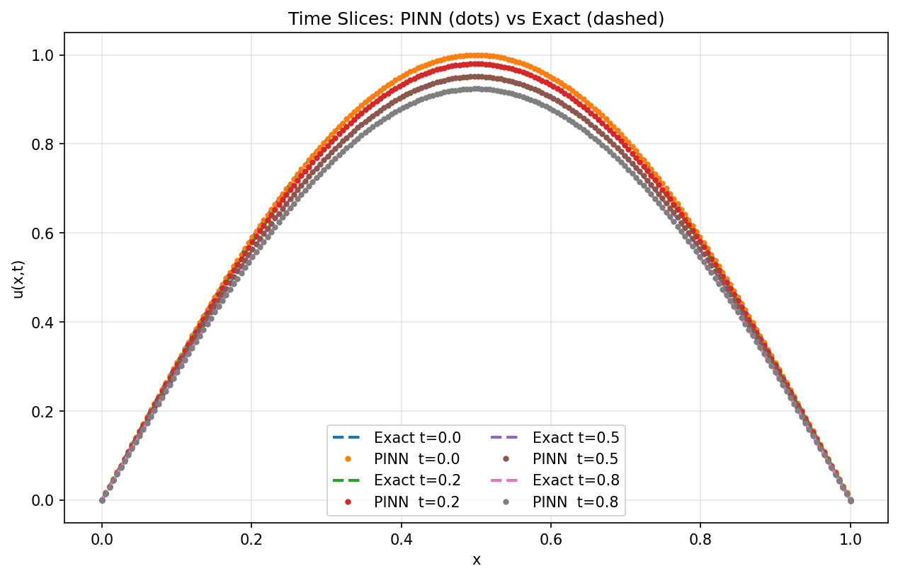

# Physics-Informed Neural Networks (PINNs) — Intro Tutorial

A minimal, hands-on introduction to PINNs using the 1D heat equation as a worked example.

---

## What is a PINN?

A **Physics-Informed Neural Network** is a neural network trained to satisfy both:

1. **Data constraints** — initial conditions (IC) and boundary conditions (BC)
2. **Physics constraints** — a governing PDE, enforced via automatic differentiation

Instead of learning from a dataset of observations, the network learns a solution function `u(x, t)` by minimizing a loss that penalizes violations of the PDE at randomly sampled collocation points. No simulation data is needed.

---

## The Problem: 1D Heat Equation

We solve:

```
∂u/∂t = ν ∂²u/∂x²,   x ∈ [0,1],  t ∈ [0,1]
```

with:
- **Initial condition:** `u(x, 0) = sin(πx)`
- **Boundary conditions:** `u(0, t) = u(1, t) = 0`
- **Thermal diffusivity:** `ν = 0.01`

The analytical solution is:

```
u(x, t) = sin(πx) · exp(−ν π² t)
```

This lets us directly measure how accurate the PINN is.

---

## How the PINN Works

### Network

A simple fully-connected network with `tanh` activations takes `(x, t)` as input and outputs `u`:

```
[x, t]  →  Linear(2→64)  →  Tanh  →  Linear(64→64)  →  Tanh  →  Linear(64→64)  →  Tanh  →  Linear(64→1)  →  u
```

### Loss Function

Three terms are combined:

```
L = L_physics + 10 · L_ic + 10 · L_bc
```

| Term | What it enforces |
|---|---|
| `L_physics` | PDE residual `u_t − ν u_xx = 0` at random interior points |
| `L_ic` | `u(x, 0) = sin(πx)` at random points along `t=0` |
| `L_bc` | `u(0, t) = u(1, t) = 0` at random points along both edges |

### Derivatives via Autograd

The spatial and temporal derivatives (`u_t`, `u_x`, `u_xx`) are computed exactly using PyTorch's `torch.autograd.grad` — no finite differences needed.

---

## Results

After 5000 epochs with Adam (lr=1e-3):

| Metric | Value |
|---|---|
| Max error | 2.58e-03 |
| Mean error | 7.36e-04 |
| L2 relative error | 1.41e-03 |




---

## Project Structure

```
.
├── 01_heat_equation_pinn.py   # Main script: network, training loop, evaluation
├── visualize_heat.py          # Visualization: heatmaps + time-slice comparison
├── heat_pinn_result.png       # Output: PINN vs exact solution (heatmaps)
└── heat_time_slices.png       # Output: time-slice comparison
```

---

## Requirements

```
torch
numpy
matplotlib
```

Install with:

```bash
pip install torch numpy matplotlib
```

---

## Run

```bash
python 01_heat_equation_pinn.py
```

Training takes ~1–2 minutes on CPU.

---

## Key Concepts to Explore Next

- **Harder PDEs** — Burgers equation (nonlinear), Navier-Stokes, wave equation
- **Inverse problems** — recover unknown PDE parameters (e.g., ν) from sparse observations
- **Adaptive sampling** — focus collocation points where the residual is large
- **Fourier features** — improve convergence for high-frequency solutions
